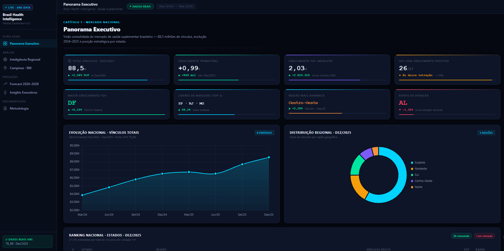

# 🏥 Brazil Health Intelligence Dashboard

## 🌐 Dashboard Online

🔗 https://callout84.github.io/brazil-health-intelligence-dashboard/

---

# 📊 Sobre o Projeto

O Brazil Health Intelligence Dashboard é um projeto de Business Intelligence desenvolvido com dados públicos da Agência Nacional de Saúde Suplementar (ANS).

O objetivo foi transformar dados brutos do setor de saúde suplementar em uma plataforma executiva capaz de apoiar análises estratégicas e tomada de decisão baseada em dados.

Este projeto faz parte da construção do meu portfólio em Data Analytics, Business Intelligence e Data Science, aplicando conceitos de análise de dados, visualização, indicadores de desempenho e storytelling analítico.

---

# 🎯 Problema de Negócio

O mercado de saúde suplementar brasileiro movimenta milhões de beneficiários e exige monitoramento constante por parte de gestores, operadoras e tomadores de decisão.

Questões importantes incluem:

* O mercado está crescendo ou retraindo?
* Quais estados lideram a expansão?
* Onde estão os principais riscos?
* Qual região apresenta maior potencial de crescimento?
* Como o mercado pode evoluir nos próximos anos?

O dashboard foi construído para responder essas perguntas de forma rápida e visual.

---

# 📁 Fonte dos Dados

Dados públicos disponibilizados pela:

**Agência Nacional de Saúde Suplementar (ANS)**

Base utilizada:

* Beneficiários de Planos de Saúde
* Série Histórica Nacional
* Informações Regionais
* Dados Trimestrais do Mercado

Período analisado:

**Março/2024 até Dezembro/2025**

---

# 🛠 Tecnologias Utilizadas

* SQL
* Python
* Pandas
* Business Intelligence
* Data Analytics
* HTML
* CSS
* JavaScript
* GitHub Pages
* Inteligência Artificial aplicada ao desenvolvimento

---

# 📈 Principais Indicadores

O dashboard apresenta indicadores executivos como:

* Total de Beneficiários
* Crescimento YoY
* Crescimento Trimestral
* Crescimento Absoluto
* Participação Regional
* Ranking por Estado
* Distribuição Geográfica
* Forecast de Mercado (2026–2028)

---

# 🔍 Principais Insights

Entre os principais achados da análise:

* 26 dos 27 estados apresentaram crescimento no período analisado.
* A Região Sudeste concentra a maior participação do mercado nacional.
* O Centro-Oeste apresentou o maior crescimento percentual.
* Alagoas foi o único estado com retração observada.
* O setor demonstra tendência de crescimento contínuo no horizonte analisado.

---

# 📊 Estrutura do Dashboard

### Panorama Executivo

Visão consolidada dos principais KPIs do setor.

### Inteligência Regional

Comparação entre estados e regiões.

### Campinas RM

Análise focada na Região Metropolitana de Campinas.

### Forecast 2026–2028

Projeções futuras do mercado.

### Insights Executivos

Resumo das descobertas estratégicas.

---

# 🚀 Objetivo Profissional

Sou estudante de Data Science em transição de carreira para a área de Dados.

Este projeto representa a aplicação prática dos conhecimentos que venho desenvolvendo em SQL, Python, Analytics, Business Intelligence e Inteligência Artificial.

Meu foco é atuar profissionalmente em posições de:

* Analista de Dados Júnior
* Business Intelligence Júnior
* Analytics Júnior

---

# 👨‍💻 Autor

**Hewerson Francelino**

Campinas - SP

GitHub:
https://github.com/Callout84

LinkedIn:
https://www.linkedin.com/in/hewerson-francelino-a86319183/
